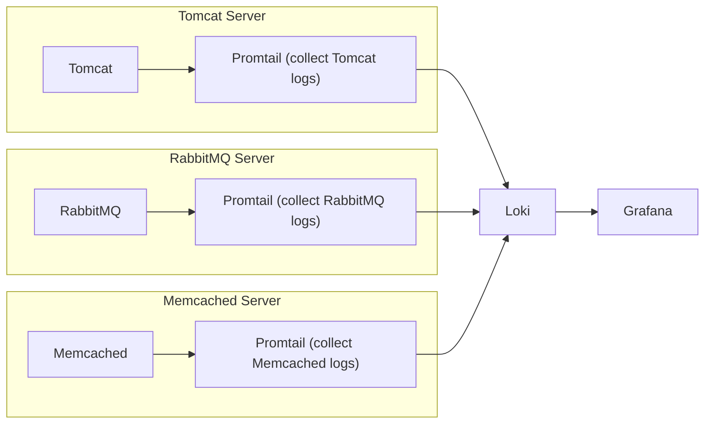
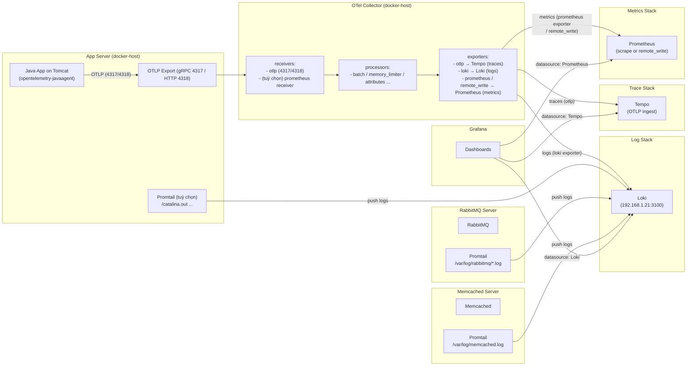

```mermaid
flowchart LR
    subgraph App_Server["Tomcat Server"]
        Tomcat
        Promtail_App["Promtail (collect Tomcat logs)"]
        Tomcat --> Promtail_App
    end

    subgraph MQ_Server["RabbitMQ Server"]
        RabbitMQ
        Promtail_MQ["Promtail (collect RabbitMQ logs)"]
        RabbitMQ --> Promtail_MQ
    end

    subgraph Cache_Server["Memcached Server"]
        Memcached
        Promtail_Cache["Promtail (collect Memcached logs)"]
        Memcached --> Promtail_Cache
    end

    Promtail_App --> Loki
    Promtail_MQ --> Loki
    Promtail_Cache --> Loki

    Loki --> Grafana
```

# OTEL

```mermaid
flowchart LR
  %% ========= NODES =========
  subgraph A["App Server (docker-host)"]
    A1["Java App on Tomcat\n(opentelemetry-javaagent)"]
    A2["OTLP Export (gRPC 4317 / HTTP 4318)"]
    A3["Promtail (tuỳ chọn)\n/catalina.out ..."]
  end

  subgraph C["OTel Collector (docker-host)"]
    C1["receivers:\n- otlp (4317/4318)\n- (tuỳ chọn) prometheus receiver"]
    C2["processors:\n- batch / memory_limiter / attributes ..."]
    C3["exporters:\n- otlp → Tempo (traces)\n- loki → Loki (logs)\n- prometheus / remote_write → Prometheus (metrics)"]
  end

  subgraph L["Log Stack"]
    L1["Loki\n(192.168.1.21:3100)"]
  end

  subgraph T["Trace Stack"]
    T1["Tempo\n(OTLP ingest)"]
  end

  subgraph M["Metrics Stack"]
    M1["Prometheus\n(scrape or remote_write)"]
  end

  subgraph G["Grafana"]
    G1["Dashboards"]
  end

  subgraph R1["RabbitMQ Server"]
    R1a["RabbitMQ"]
    R1b["Promtail\n/var/log/rabbitmq/*.log"]
  end

  subgraph R2["Memcached Server"]
    R2a["Memcached"]
    R2b["Promtail\n/var/log/memcached.log"]
  end

  %% ========= FLOWS =========
  %% App → Collector (OTLP traces/metrics/logs)
  A1 -->|"OTLP (4317/4318)"| A2 --> C1

  %% Collector pipeline
  C1 --> C2 --> C3

  %% Collector exports
  C3 -->|"traces (otlp)"| T1
  C3 -->|"logs (loki exporter)"| L1
  C3 -->|"metrics (prometheus exporter\n/ remote_write)"| M1

  %% Promtail → Loki (file logs path)
  A3 -->|"push logs"| L1
  R1b -->|"push logs"| L1
  R2b -->|"push logs"| L1

  %% Grafana reads
  G1 -->|"datasource: Prometheus"| M1
  G1 -->|"datasource: Loki"| L1
  G1 -->|"datasource: Tempo"| T1
```
